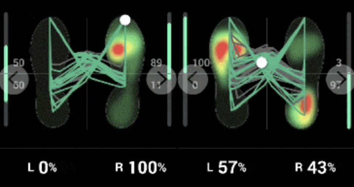

# intel03_team03_foot

- 딥러닝을 활용한 동적 족저압 기반 보행이상 검출
    - 여러개의 압력센서 기기를 이용한 족저압 데이터추출.
    - **CNN-LSTM** 아키텍처를 활용하여 시공간적 보행 패턴 분석
    - **동적 족저압 데이터를 분석**하고 **보행 이상 검출하는 딥러닝 모델 개발.**
    
    
    
    - 걸음걸이 6단계를 구분한 14개의 압력센서 기기 2개를 이용해 왼발,오른발의  무게값을 히트맵화하여 무게중심(COP)점을 확인 및 관련 데이터 이동 궤적을 학습시켜 환자의 정상 유무를 판별.
    
    
    
    - 웹  UI에서 환자 이름,날짜를 입력해 환자 정보를 특정하고, 측정을 진행할 기기 연결 유/무 버튼을 통해 기기 연결을 확인하고, 측정 시작 및 중지 버튼을 통해 측정 관리를 수행.
    - 학습 데이터와 환자 데이터를 비교하여 환자의 보행 이상 정도와 데이터를 안내해주는 메세지 안내.
    
    
    - (advanced 1) 측정 결과 값을 저장 및 불러오기를 통해 측정 환자의 이전 측정 결과들을 분석하여 치료 경과를 관측.
    - (advanced 2) 챗봇 서비스와 연계하여 보행문제에 대해 간단한 상담을 진행할 수 있는 sw제작.

## High Level Design

- use case


- sequence diagram
    
    
    
- class diagram
    
    
    

## Clone code


```
git clone https://github.com/jo5862/intel03_team3_foot.git

```

## Prerequite

---

- requirements.txt를 이용해 환경 설치

```
python -m venv .venv
source .venv/bin/activate
pip install -r requirements.txt
```

- openvino 설치 필요
    
    https://docs.openvino.ai/archives/index.html
    

## Steps to build

- (프로젝트를 실행을 위해 빌드 절차 기술)

```
cd ~/xxxx
source .venv/bin/activate

make
make install

```

## Steps to run

- (프로젝트 실행방법에 대해서 기술, 특별한 사용방법이 있다면 같이 기술)

```
cd ~/xxxx
source .venv/bin/activate

cd /path/to/repo/xxx/
python demo.py -i xxx -m yyy -d zzz

```

## Output

- (프로젝트 실행 화면 캡쳐)


## Appendix


### 0.Data_set

[93 Human Gait (walking) Database](https://www.kaggle.com/datasets/drdataboston/93-human-gait-database?resource=download)

[요통 환자의 골반 높이 비대칭과  발바닥 압력 분포](https://m.blog.naver.com/realptman/222795018297)

### 1.AI_Model

### 2.Hard_Ware

[Taidacent 14 FSR 독립 분산 압력 감지 RX-ES39A Piezoresistive Flexible 필름 발바닥 압력 센서](https://korean.alibaba.com/product-detail/Taidacent-14-FSR-Independent-Distributed-Pressure-62014289816.html)
