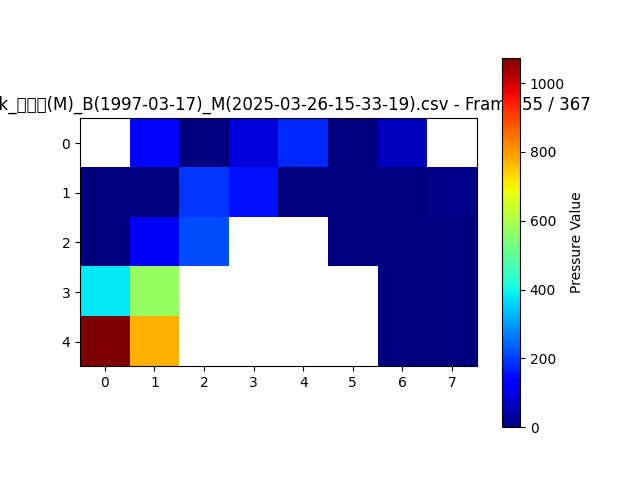
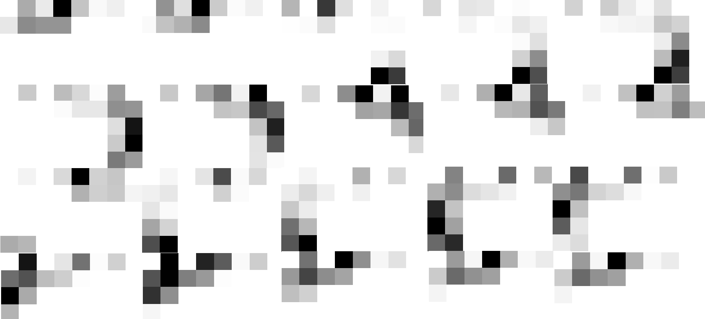
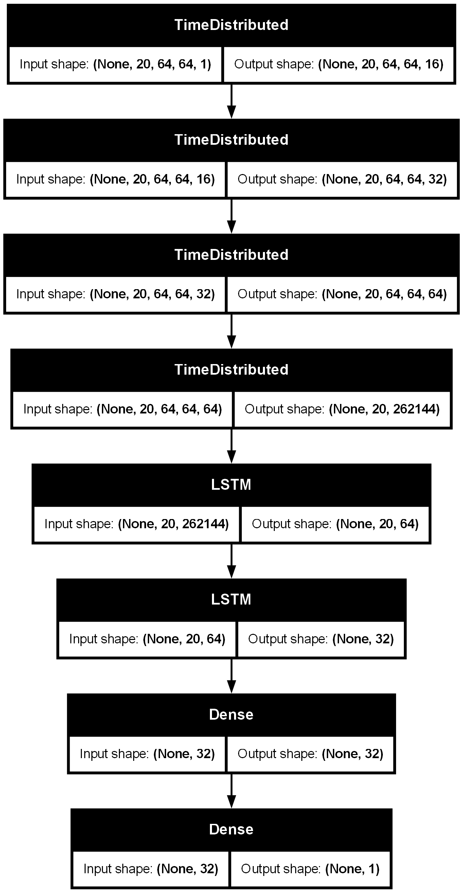
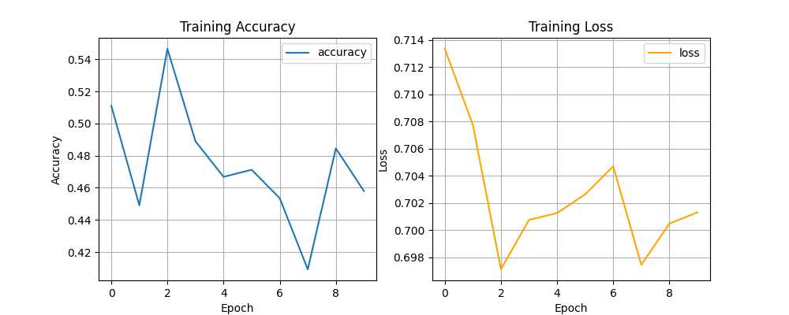
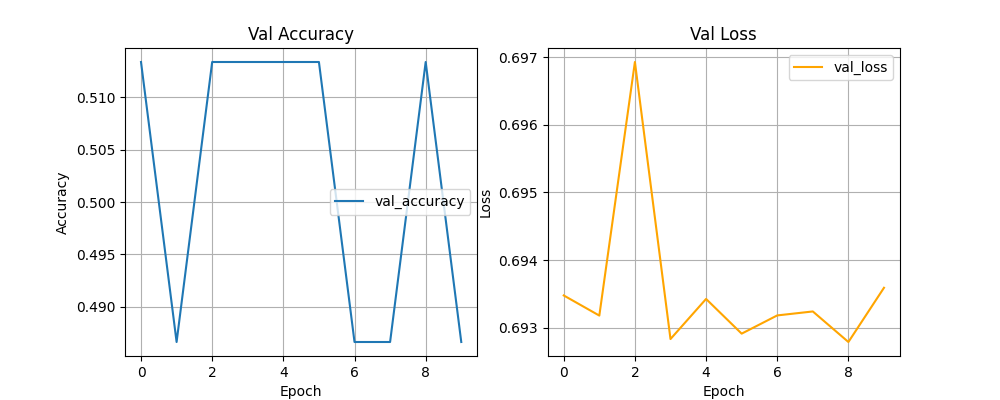

# CRNN 모델 학습

## 모델 설계

### 패턴 추출

히트맵을 생성 할 때, 받은 데이터의 범위는 0 ~ 2048의 범위를 가진 값을 받는다.

> STM32의 아날로그 ADC가 3.3v의 전압을 4096으로 나눠서 정수로 보내지만 해당 센서 VCC에는 10K옴 풀다운 저항이 존재해 1.7v를 읽어 2048 > 까지의 값을 검사용 PC에 송신한다.

하지만 센서의 최대값은 약 20kg이고, 측정하는 환자는 몸무게에 따라 데이터들의 최대값과 범위가 달라지게 됨으로써 몸무게데 따라 데이터가 변하게 된다.

이를 MinMaxNormalization으로 0과 1사이의 값으로 다시 정규화하여 몸무게의 영향을 없애고 보행의 패턴만 뽑아서 추출한다.

 

### 보행 구간 나누기

위에선 보행 패턴을 추출했다면 이번엔 보행 구간을 잘라서 시계열 데이터로 모델에 입력해야 한다.

raw값을 바로 입력하면 환자의 걸음걸이 속도에 따라 spride length 사이에 들어가는 프레임의 갯수가 달라지게 된다.

프로젝트에 사용하는 STM32는 데이터 갱신 주기가 50hz로 1초당 50개의 데이터 열을 입력받는데, 센서의 데이터 값을 받지 못하면 왼쪽 센서의 경우는 데이터 열이 입력받지 않고 넘어가고, 오른쪽 발이 데이터를 못받으면 nan값으로 채워지게 된다.

이 결측치의 문제와 보행의 속도에 따라 spride length의 프레임 수가 달라지기에 1 spride length 기준으로 일정한 구간을 나누기로 진행했다.

 

1 spride를 여러 논문에선 4구역, 6구역으로 나누거나, 발꿈치가 닫는 시점부터 발가락이 떨어지는 구간을 6단계로 나누어 분석하지만, 직접 시각화를 진행해 보니 구간 사이의 보행 패턴의 변화가 눈에 띄게 많아, 6구역으로 나누는건 데이터 낭비가 심하다 판단이 되었다.

또한 CoP의 이동 동선을 보고 진료를 하는 경우는 센서가 갱신되는 최대 갱신값을 기준으로 그려내어 매우 부드러운 곡선이 나오는 것을 볼 수 있다.

이로써, 실험적으로 20구간으로 나누어 사용하였다. (Batch 20)

 

### 패턴 시각화

프로젝트에서 사용하는 FSR 센서는 5개의 행과 4개의 열을 가진 어레이 형태다.

이 28개의 데이터로 고해상도의 히트맵을 생성하는 의학 지식이나 논문 등 근거 자료를를 기한 내 찾을 수 없었기에 한발에 5 * 4 픽셀을 가진 이미지를 생성하였다.

이 5 * 4 픽셀을 가진 이미지를 양발로 붙히면 5 * 8 이미지가 생성되고 다음과 같은 히트맵을 생성할 수 있었다.

이 이미지를 (20, 5, 8, 1) 형태로 변경하여 모델학습에 사용하였다.

1채널로 바꾸기 위해 1색으로 값을 표현하는 "Greys" 컬러맵으로 표현하였고 20 batch로 모델에 넣었었다.

20장의 이미지는 위와 같은 모습이다.

 

## 모델 학습

위의 데이터로 모델 학습을 진행했다.

20 batch의 CNN 레이어기에 TimeDistribute를 이용하였다.

레이어를 위와 같이 쌓아서 학습을 시킨 결과이다.

Loss값을 보면 모델이 학습을 전혀 진행하지 못하는 모습을 볼 수 있다.

## 고찰

### 문제점 1. CNN 레이어를 사용하기에 이미지 사이즈가 너무 작다.

CNN레이어는 커널을 이미지 위로 돌아가면서 특성을 추출하는 레이어다.

하지만 레이어가 특성을 추출하기엔 이미지 사이즈가 너무 작고, AvgPooling이나 MaxPooling은 0 padding으로 이미지의 특성을 뽑고 이미지 사이즈를 줄일 수 있지만, 

> 5 * 8 => (6 * 8) => 3 * 4 => (4 * 4) => 2 * 2

흔하게 CNN 예제로 사용하는 MNIST 예제 또한 28 * 28 크기의 이미지 사용한다. 비교하면 매우 작은 이미지를 다루고 있고 이로 인해 특징 추출이 잘 안됬을수도 있다고 생각한다.

 

**향후 계획**

28개의 데이터를 더 늘릴 수 없으니 이 데이터를 이용해서 더 고해상도의 히트맵을 생성하는 방법을 찾아야 한다.

 

### 문제점 2. LSTM에 거의 0만 들어가서 가중치가 업데이트 되지 않았다.

가중치를 확인할 시간이 없었지만 가중치가 업데이트가 안된다는 문제점이 있을 수 있다.

> Understanding LSTM Networks
> https://colah.github.io/posts/2015-08-Understanding-LSTMs/

위 자료는 LSTM 레이어를 설명하는 자료다.

지금 히트맵은 28개의 데이터를 40픽셀에 넣는 형식이기에 기존 데이터 대비 0값이 12개 더 들어가는 형식이다.

힐 스트라이크 기준 28개 데이터도 노이즈를 포함해도 약 8개, 노이즈를 제거하면 약 2 ~ 4개의 데이터만 얻게 되고 나머지는 0으로 채워지게 된다.

힐 스트라이크로 2개의 데이터만 받는다 가정하면 CNN레이어 사용 전 데이터는 38개가 0으로 되어 있는 형태이다.

CNN 레이어가 이 2개의 데이터를 추출한다 하더라도 거의 모든 데이터가 0으로 이루어져 있기에 LSTM에서 cell state가 0으로 유지된다.

이러면 모델은 거의 0만 받아서 학습을 하게되고 제대로 된 모델학습이 진행되지 않는다.

 

**향후 계획**

0의 값을 줄이기 위해 직접 시계열 데이터를 입력하거나 다른 데이터 전처리가 필요

 

