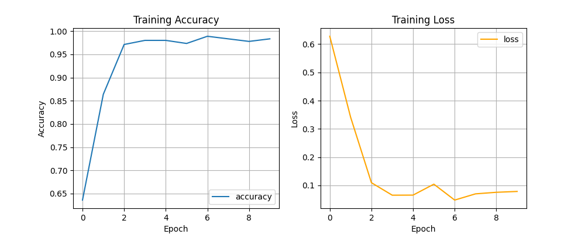

# RNN 모델 학습

## 모델 설계

### 패턴 추출

히트맵을 생성 할 때, 받은 데이터의 범위는 0 ~ 2048의 범위를 가진 값을 받는다.

> STM32의 아날로그 ADC가 3.3v의 전압을 4096으로 나눠서 정수로 보내지만 해당 센서 VCC에는 10K옴 풀다운 저항이 존재해 1.7v를 읽어 2048 > 까지의 값을 검사용 PC에 송신한다.

하지만 센서의 최대값은 약 20kg이고, 측정하는 환자는 몸무게에 따라 데이터들의 최대값과 범위가 달라지게 됨으로써 몸무게데 따라 데이터가 변하게 된다.

이를 MinMaxNormalization으로 0과 1사이의 값으로 다시 정규화하여 몸무게의 영향을 없애고 보행의 패턴만 뽑아서 추출한다.

 

### 보행 구간 나누기

위에선 보행 패턴을 추출했다면 이번엔 보행 구간을 잘라서 시계열 데이터로 모델에 입력해야 한다.

raw값을 바로 입력하면 환자의 걸음걸이 속도에 따라 spride length 사이에 들어가는 프레임의 갯수가 달라지게 된다.

프로젝트에 사용하는 STM32는 데이터 갱신 주기가 50hz로 1초당 50개의 데이터 열을 입력받는데, 센서의 데이터 값을 받지 못하면 왼쪽 센서의 경우는 데이터 열이 입력받지 않고 넘어가고, 오른쪽 발이 데이터를 못받으면 nan값으로 채워지게 된다.

이 결측치의 문제와 보행의 속도에 따라 spride length의 프레임 수가 달라지기에 1 spride length 기준으로 일정한 구간을 나누기로 진행했다.

 

1 spride를 여러 논문에선 4구역, 6구역으로 나누거나, 발꿈치가 닫는 시점부터 발가락이 떨어지는 구간을 6단계로 나누어 분석하지만, 직접 시각화를 진행해 보니 구간 사이의 보행 패턴의 변화가 눈에 띄게 많아, 6구역으로 나누는건 데이터 낭비가 심하다 판단이 되었다.

또한 CoP의 이동 동선을 보고 진료를 하는 경우는 센서가 갱신되는 최대 갱신값을 기준으로 그려내어 매우 부드러운 곡선이 나오는 것을 볼 수 있다.

이로써, 실험적으로 20구간으로 나누어 사용하였다. (Batch 20)

 

### 시계열 데이터 전처리

데이터를 CNN 레이어로 특징 추출을 하지 않고 직접 모델에 시예열 데이터를 입력하는 형태로 변형한다.

모델에 직접 입력하기 위해 numpy 배열 형태인 .npy 포멧으로 저장한다.

> sequence.npy

 

## 모델 학습

위의 데이터로 모델 학습을 진행했다.

간단한 RNN 레이어로 진행하였다.

레이어를 위와 같이 쌓아서 학습을 시킨 결과이다. 

 

혼동행렬은 위와 같은 모습으로 특별한 에러 없이 잘 분류되었다.

## 고찰

기존 CRNN으로 학습시킨 것보다 매우 높은 정확도를 보여준다. 과적합이 된 것인지 확인하기 위해 테스트 데이터로 혼동 행렬을 만들어본 결과 58 / 57개, 잘 분류된 것을 볼 수 있다. 

데이터 라벨을 더 많이 만들 수 있는 시간이 부족했기에 2개로 이중분류기를 만들었다라는 점이 아쉽지만 이중분류가 완벽하게 되는 점을 볼 때, 라벨을 추가해도 모델이 잘 분류할 수 있을 것이라고 기대한다.

