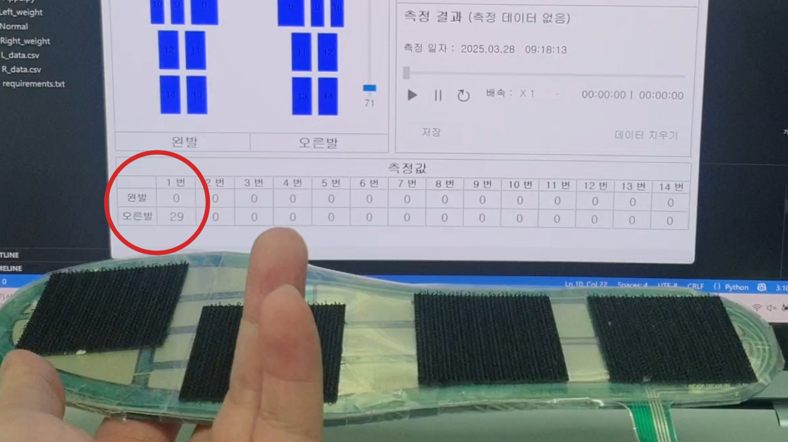

# 데이터 전처리 과정

14개의 FSR 센서로 이루어진 RX-ES39A에서 받은 데이터를 모델에 학습시킬 수 있도록 전처리를 진행하는 단계입니다.

 

## 데이터 시각화

센서에서 데이터를 받아 저장하면 아래와 같은 형태이다.

인간의 눈으론 해당 데이터가 무슨 의미와 형태를 가진지 알 수 없다.   

시각화를 하기 위해서 위 데이터의 양발 데이터 합을 평균낸 값을 시간축에 그래프를 그리면 아래와 같이 그래프가 출력된다.

걸음걸이 구간에서 연속된 패턴이 보인다.

 

## 데이터 구간 선정

데이터에서 노이즈를 제거하고 데이터의 패턴을 모델에 학습시키기 위해서 구간별로 자르는 작업을 진행하였다.

하지만 데이터를 자르는 기준이 애매해서 아래의 논문을 참고하여 자른 데이터의 그래프를 출력해보았다.

참고자료 :

>[학위논문] 족저압을 이용한 보행 밸런스 분석Analysis of Gait balance using Plantar Pressure - 이명재 - 9p
>https://scienceon.kisti.re.kr/srch/selectPORSrchArticle.do?cn=DIKO0015549935#;

 

위 논문에선 진행하는 프로젝트와 유사한 프로젝트를 진행했는데,

보행의 구간을 나누는 걸 'Heel Strike'를 기준으로 보행의 구간을 나누었다.

 

위 기준을 따라 구간을 정해서 그래프로 출력하면

위 모습과 같이 패턴단위로 데이터를 자를 수 있게 되었다.

 

## 데이터 전처리

모델 학습을 위해 데이터를 나눠 패턴으로 자르는 구간이다.

 

### 가속, 감속 구간 제거

위 데이터를 보면 일정하게 걷는 구간만 존재하는게 아니라 멈추거나, 가속, 감속 구간이 존재한다.

위 논문에서 자르는 기준으로 앞과 뒤의 가속, 감속 구간의 데이터를 제외했다.

 

### 결측치 제거

위와 같이 nan값이 있는 데이터는 제거한다.

 

### 센서 튐 제거

센서값이 튀어서 패턴 이외의 모습을 보여주는 데이터는 제거한다.

 

## 데이터 split

scikit-learn을 이용해서 train : val : test => 8 : 1 : 로 나누었다.

**normal**

- 전체 파일 개수: 573
- 훈련(train) 파일 개수: 458
- 검증(val) 파일 개수: 57
- 테스트(test) 파일 개수: 58

**Right_weight**

- 전체 파일 개수: 563
- 훈련(train) 파일 개수: 450
- 검증(val) 파일 개수: 56
- 테스트(test) 파일 개수: 57

 

## 데이터 노이즈 

### 시제품 구조적 노이즈

시제품은 슬리퍼를 이용하여 제작했다.

오른발이 다 바닥에 닿은 상태면 왼발이 바닥에 닿는 구간이 없어야 하는데 위 히트맵을 보면 왼발 엄지 부분에 값이 들어와 있는 모습을 볼 수 있다.

시제품이 슬리퍼이기에 보행 시 슬리퍼가 발에서 벗겨지지 않도록 무의식적으로 앞발이 움직이는 경우가 있고, 슬리퍼를 차면서 앞으로 보행할 때, 엄지 부분이 슬리퍼의 관성으로 밀릴 수 있기에 이런 노이즈가 발생했다고 생각한다.

 

### 센서에 의한 노이즈

사용한 FSR센서는 얇은 필름형 센서이다.

문제는 이 필름형 FSR센서가 구부러지면 저항값이 변하여 센서에 데이터가 들어온다는 점이다.

그래서 센서에 휘었다가 다시 원상복구가 되는 아크릴을 붙혔지만 아크릴이 부셔지면서 필름이 원상복구가 못되고 휘어있는 상태가 지속해서 센서 데이터에 노이즈가 꼈다.

프로토타입(위) 모습과 부셔진 아크릴 사진(아래)

 

위 사진과 같이 하중이 없는 상태에서도 오른발 1번 센서에 쓰레기 데이터가 들어오고 있는 모습이다.

직접 얻은 데이터의 99퍼가 노이즈가 꼈지만 다시 측정하기엔 시간이 부족해서 노이즈가 낀 데이터로 프로젝트를 진행하였다.

